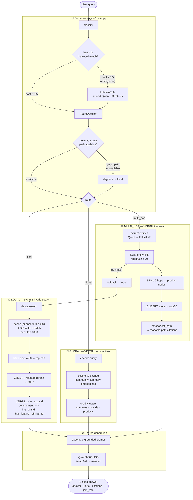

# ⚔️ SPARDA — A Query Router that Composes Two Retrieval Engines into One Answer

> **Demo (decommissioned):** a live Modal deployment ran Jun–Jul 2026 — custom streaming frontend,
> vLLM-served Qwen3-30B (+ a Claude Opus 4.8 comparison arm), route badges, neuron knowledge graph.
> The Modal footprint was fully torn down after export; all artifacts are archived offline and every
> stage is reproducible from this repo (`modal_run.py`, `modal_demo.py` — see How to run).
> **Run it locally without Modal → [LOCAL_RUN.md](LOCAL_RUN.md).**

SPARDA is a **query router** for e-commerce discovery. It classifies each incoming query,
routes it to the right retrieval strategy across **two of my own standalone engines**, and
returns a single unified answer with typed citations and a visible "why this path" decision.

- **DANTE** — a multi-stage **hybrid product search** engine (dense bi-encoder + SPLADE
  learned-sparse + BM25, fused with Reciprocal Rank Fusion, reranked by a ColBERT
  late-interaction reranker).
- **VERGIL** — a **GraphRAG knowledge graph** over the product catalog (brand / category /
  feature / `similar_to` edges, Leiden community detection + LLM community summaries).

SPARDA does not re-implement either. It **vendors them as source** and orchestrates their
public APIs behind one router, one shared generator, and one answer schema. The engineering
story is the router + the composition + a **deployed, streaming web demo** — and a long,
honest list of real bugs fixed to get there (see [Engineering journey](#engineering-journey--what-we-tried--what-broke)).

### Headline facts

| | |
|---|---|
| **Router accuracy** | **15/15 = 1.000** on the typed test set; all three routes execute end-to-end |
| **Routes** | `local` (DANTE + 1-hop graph expand) · `global` (VERGIL community summaries) · `multi_hop` (VERGIL graph traversal + path citations) |
| **Generator** | **Qwen3-30B-A3B-Instruct-2507** (MoE, 30B total / 3B active, Apache-2.0), temp 0.0, **token-streamed** |
| **Serving** | **vLLM** (CUDA graphs, continuous batching): **~113 tok/s** decode — a ~500-token answer in **~5s** (HF `.generate()` baseline: ~6 tok/s / ~75s) |
| **Graph** | VERGIL's own ~570K-edge product graph + **1,209** synthesized `complement_of` ("goes-with") edges |
| **Cross-dataset join** | **0.82%** ASIN overlap (2,898 of 351,961 ESCI × 49,997 electronics) — reported honestly; see [Limitations](#limitations) |
| **Comparison arm** | **Claude Opus 4.8** via the API — same routing + retrieval, generation switches per query; a ⚔ Compare mode streams both generators side-by-side |
| **Deployment** | Modal FastAPI + hand-built static frontend (SSE delta streaming, canvas neuron-graph; also CDN-hosted on Vercel), one A100-80GB, scale-to-zero (10-min warm window), read-only artifact volumes |

The 0.82% number is deliberately front-and-center. SPARDA's value is the **router**, not a
deep cross-dataset fusion — `multi_hop` runs on VERGIL's own graph via query→entity linking,
independent of the tiny ASIN join. Being honest about that is part of the project.

---

## Why a router at all

The founding observation: **e-commerce discovery queries are not one distribution.** They
come in (at least) three shapes, and each shape wants a *different* retrieval strategy:

| query shape | example | what it actually needs |
|---|---|---|
| **Specific-product** | "best wireless noise cancelling headphones under $300" | a *ranked list* — dense + learned-sparse + lexical retrieval over product text, then a strong reranker |
| **Market-overview** | "compare the smart home ecosystems" | *aggregated structure* — no single product answers it; it needs knowledge summarized across whole clusters of the catalog |
| **Relational** | "accessories from Sony that work with the WH-1000XM5" | *connections* — traverse brand / compatibility / goes-with edges, and show the path taken |

A one-size-fits-all RAG stack serves the first shape and quietly underserves the other two.
Ask a flat vector index to "compare smart home ecosystems" and it returns the listings whose
text is closest to those words — individual products, not a market view. Ask it for
"accessories that work with X" and it returns things that *sound like* X, because a flat
index has no edges to walk and no way to say *why* an accessory relates to the anchor
product. VERGIL's GraphRAG build answers the second shape (Leiden communities + offline LLM
community summaries) and the third (graph traversal with path provenance); DANTE's hybrid
retrieval + rerank stack is the right tool for the first. SPARDA's job is the missing piece:
**decide, per query, which machinery to invoke — cheaply, transparently, and with a graceful
fallback when the data can't support the fancy path.**

That framing matters doubly here because of the honest data reality. The cross-dataset ASIN
join between DANTE's ESCI catalog and VERGIL's Amazon-2023 graph is **0.82%**, so a "deep
fusion" story — graph features enriching every retrieval hit — was never on the table. What
survives contact with that number is precisely the router: each route stands on data its own
engine actually has (DANTE's indices; VERGIL's ~570K-edge graph, reached by linking the
*query's* entities rather than retrieved products; VERGIL's cached community summaries). The
join is reported as an informational metric instead of load-bearing infrastructure, and the
decision layer — classification, confidence, degradation, and the visible "why this path" —
is the part that would transfer unchanged to a dataset pair with a 90% join. That is why the
router, not the fusion, is called the core IP.

---

## Architecture



### Components

**Router (`engine/router.py`) — the core IP.** A three-stage decision that is fast and
cheap first, smart only when it has to be:

1. **Heuristic.** Regex over a `MULTI_HOP_KEYWORDS` set ("works with", "compatible",
   "accessories", "goes with", …) then a `GLOBAL_KEYWORDS` set ("compare", "vs", "trend",
   "ecosystem", …). A strong match returns immediately with high confidence — free and
   deterministic. No keyword → a weak `local` default at confidence 0.4.
2. **LLM fallback.** Only if heuristic confidence `< 0.5` and the shared LLM exists, ask
   Qwen for a **one-word** label (`local` / `global` / `multi_hop`) at temp 0.0. Ambiguous
   queries get real classification without paying for the LLM on the easy ones.
3. **Coverage gate.** If the chosen path is graph-dependent (`global` / `multi_hop`) but the
   graph can't serve it, **degrade to local** — DANTE always works.

Every decision is returned as a `RouteDecision` (route, method, confidence, matched rule,
reason, available paths) so the pipeline logs it and the demo renders a "why this path" badge.

**Anatomy of a `RouteDecision`.** The router never returns a bare string — every
classification is a small dataclass the rest of the system treats as evidence:

```python
@dataclass
class RouteDecision:
    route: str              # 'local' | 'global' | 'multi_hop'
    method: str             # 'heuristic' | 'llm_fallback' | 'degraded'
    confidence: float       # 0-1 (heuristic match strength or LLM logprob proxy)
    matched_rule: str       # which keyword/regex fired (shown in the demo)
    reason: str             # human-readable, rendered in the UI
    available_paths: list   # from the coverage check
```

`method` makes the decision's *provenance* first-class: the demo badge can distinguish "a
relational keyword fired" from "the LLM was consulted" from "we wanted multi_hop but degraded".

**Heuristic tier in detail.** Relational patterns (`MULTI_HOP_KEYWORDS`) are tried first and
return at confidence **0.85**; market patterns (`GLOBAL_KEYWORDS`) return at **0.8**; no
match yields a `local` default at **0.4** — deliberately *below* the
`LLM_FALLBACK_THRESHOLD` of **0.5**, so every keyword-less query gets a real LLM
classification instead of a blind default (when an LLM is attached; a heuristic-only router
still works without one). The patterns are **word-boundary-anchored stems**, not bare
substrings: `\bcompar`, `\btrend`, `\bcompatib`, `\baccessor`, `\becosystem` keep the
inflection reach of the old substrings (*comparing, trending, compatibility, accessories,
ecosystems*) without cross-word hits, and `\bvs\b` can no longer fire inside "TVs". All
patterns are **precompiled once at import** — an earlier version re-parsed every regex on
every query.

**LLM fallback in detail.** A single cheap call: the classification prompt, `max_tokens=4`,
`temperature=0.0`. The response is parsed leniently — scan for the first of
`multi_hop` / `global` / `local` in the output (so "Category: local." still parses) — and
returned at confidence 0.7 with `method="llm_fallback"`.

**Coverage gate + graceful degradation in detail.** `engine/coverage.py` computes a
`CoverageReport` **once at startup**: `local` is always available (DANTE stands alone);
`multi_hop` requires the graph to actually have edges; `global` requires communities to
exist. If the router picks a graph path that isn't available, it re-issues the decision as
`local` with `method="degraded"` and a reason saying what was skipped. There is a second,
*per-query* degradation inside the pipeline itself: if multi-hop entity linking finds **no**
graph node for any extracted entity, the query falls back to a full local search rather than
answering from nothing. (A per-query coverage re-check — stripping graph expansion when
*this* query's retrieved products are absent from the graph — was designed but deliberately
left unwired: it changes routing behavior, so it needs an end-to-end eval first.)

**The routing history — two real bugs, both instructive.** The router's honest track record
is part of its documentation:

1. **The coverage gate silently killed multi_hop** (journey #1). The original gate required
   the cross-dataset ASIN join to be ≥ 5% before allowing `multi_hop`. The real join is
   0.82%, so *every* relational query silently degraded to local — even though multi_hop
   never needed the join at all (it links the *query's* entities into VERGIL's own ~570K-edge
   graph). The fix gates on the graph's own properties and demotes `join_rate` to an
   informational metric.
2. **`"vs"` matched inside `"tvs"`** (journey #12). Substring keyword matching sent
   *"best TVs under $500"* to global community search at confidence 0.8. The word-boundary
   rewrite fixed it — and the same bug class turned up and was fixed in VERGIL's own router.

After the rewrite: **18/18** unit routing checks, a re-run **15/15** end-to-end typed suite
with a perfect confusion matrix (local 5/5, global 5/5, multi_hop 5/5 — including
"Sony vs Bose" → global, proving `\bvs\b` still fires as a real word, and
"JBL vs Sonos accessories" → multi_hop), and a live warm check: *"best tvs under 500"* now
matches no keyword, falls through to the LLM fallback, and routes local.

**LOCAL route (`engine/local_search.py`).** DANTE's 4-signal retrieval — dense
(bi-encoder → FAISS inner-product), SPLADE learned-sparse, and BM25, each top-1000 → **RRF
fuse** (k=30) → top-200 → **ColBERT MaxSim rerank** → top-K. Then VERGIL expands the top-5
results with 1-hop graph neighbors along the edges that actually exist on the data
(`complement_of`, `has_brand`, `has_feature`, `similar_to` — **not** `bought_together`,
which is empty on Amazon-2023). If nothing retrieved is in the graph, expansion is simply
empty and local still answers.

**GLOBAL route (`engine/global_search.py`).** For market-level questions ("compare smart
home ecosystems"). Encode the query with VERGIL's own encoder (bge-small, 384-d — the same
space the summaries were embedded in) and cosine-match against the **pre-computed,
cached** community-summary embeddings; return the top-5 clusters. No per-query
summarization, no graph walk — the summaries were generated offline during VERGIL's build.

**MULTI_HOP route (`engine/multi_hop_search.py`).** For relational questions ("accessories
from Sony that work with the WH-1000XM5"): (1) extract entities via Qwen; (2) fuzzy-link each
to a graph node (`rapidfuzz`, threshold 70) — if none match, the pipeline falls back to
local; (3) BFS up to 2 hops to discover product nodes; (4) score them with DANTE's ColBERT
reranker → top-20; (5) build a readable **reasoning path** per product
(`A --[has_brand]--> Sony --[…]--> B`) used as a citation. Entity linking runs through the
shared cached name index (`engine/graph_index.py` — see the pipeline deep-dive below).

**Shared generator + unified schema (`engine/pipeline.py`).** One `Qwen3-30B-A3B` instance
serves the router, the entity extractor, and all three answer paths — never reloaded per
mode. `_prepare()` does routing + retrieval once, shared by the blocking `answer()` and the
streaming `answer_stream()`. Every route returns the same schema:

```python
{
  "answer":    "...",                       # grounded natural-language answer
  "route":     "local" | "global" | "multi_hop",
  "routing":   {method, confidence, reason, available_paths},
  "citations": [{type, id, name, evidence}, ...],   # product / graph_edge / community / path
  "join_rate": 0.0082,                      # informational
  "context":   {...},                       # raw retrieval context
}
```

One schema means the demo, the eval harness, and any downstream caller see the same shape no
matter which path ran — and every citation is *typed* provenance (`product` from
retrieval/rerank, `graph_edge` from 1-hop expansion, `community` from cluster hits, `path`
from graph traversal), so an answer can always show its work.

**Ordering: classify → cache-check → retrieve.** `answer()` and `answer_stream()` both call
`_classify()` first, build the cache key from `(normalized query, route, generator)`, and
only *then* run `_prepare()` (retrieval + prompt assembly). The ordering is itself a bug fix
(journey #12): the cache was originally consulted only *after* `_prepare()` had already paid
for routing **and** retrieval — including a multi-hop BFS + ColBERT rerank — so a cache hit
saved nothing but the final LLM call. Now a hit skips retrieval entirely (stub-verified: a
second identical query performs no retrieval), and `answer_stream()` replays a cached answer
as a single chunk. Classification stays outside the cached region on purpose: it is cheap
(a regex pass, or at most one ≤4-token LLM call) and its result is part of the key.

**Per-generator caching.** The generator name (`local` = the self-hosted Qwen, `claude` =
the comparison arm) is part of the cache key, so Compare mode's two answers to the same
query never cross-contaminate, and switching generators re-generates rather than replaying
the other model's words.

**One `_prepare()` for blocking and streaming.** Retrieval, citation building, and prompt
assembly live in a single `_prepare(query, decision)` shared by `answer()` and
`answer_stream()` — the two entry points cannot drift apart, and streaming pays retrieval
exactly once, before the first token.

**Tolerant entity extraction.** `_extract_entities()` accepts *any* shape Qwen emits — a
JSON list of strings, a list of dicts (`[{"brand": "Sony"}]`), an `{"entities": [...]}`
object, or prose-wrapped JSON — and flattens all of them into a deduplicated `list[str]`,
falling back to salient query tokens (>3 chars) if extraction yields nothing. Journey #3 is
why: downstream code calls `entity.lower()`, and a dict there crashed every multi-hop query.

**The shared entity-link index (`engine/graph_index.py`).** Fuzzy entity linking used to be
a Python-level `fuzz.partial_ratio` loop over **every node in the ~65K-node graph, per
entity, per query** — and the demo paid it *twice per user action*, because `/api/query` and
`/api/graph` both link entities. The replacement builds a `(node_ids, lowercased_names)`
index **once per graph object** and matches with `rapidfuzz.process.extractOne` (C level,
`partial_ratio`, cutoff 70 — preserving the original strictly-greater-than win condition).
The cache is a `WeakKeyDictionary` keyed by the graph object itself, so a freshly loaded
graph can never see a stale index and nothing needs manual invalidation. Both
`engine/multi_hop_search.py` and `demo/graph_viz.py` link through it.

**Composition boundary (`sparda_runtime.py`).** `build_pipeline()` constructs the DANTE
engine from the read-only `dante-artifacts` volume, loads VERGIL's graph / communities /
cached summaries from `vergil-artifacts` (preferring SPARDA's complement-edge-enriched graph
if present), and injects one shared `QwenLLM`. Two small **adapters** bridge scaffold↔shipped
interface gaps without touching the engine code: a `_ColbertShim` (exposes
`dante.colbert.rerank(...)` over the module-level `colbert_rerank`) and a `_SpladeShim`
(adds `visualize_expansion` as a method for the demo panel). All heavy imports live inside
functions, so the module imports fine in CI where neither dependency is installed.

### Grounding & prompt design (`engine/prompts.py`)

Every answer prompt embeds two shared blocks, and each exists because of a specific failure.

**`_GROUNDING` — the anti-fabrication contract.** Born from journey #8 (the "Galaxy S20
upgrade" investigation). The block is embedded verbatim in all three route prompts:

- use **only** the numbered items — they are the entire product catalog for this answer;
- never invent, assume, or recall from memory a product name, model number, spec, price,
  rating, or availability;
- recommend only listed products, referring to each by its exact shown name (citable as "#N");
- never mention or compare against an unlisted product — not even as a reference point or
  "vs." example; omit the comparison entirely;
- only state a specification if it is written in that item's own text;
- treat sellers' own title superlatives ("Best", "#1", "Award-winning", "CNET's Award") as
  marketing, never as verified quality — ESCI ranks by **text relevance**, not reviews or
  sales, so superlative queries are answered as "closest matches", not curated picks;
- if the listed items don't actually answer the question, say so plainly and describe the
  closest options that *are* listed.

The origin is the project's favorite honest correction: the "S20 FE hallucination" that
motivated the hardening turned out to be a **misdiagnosis** — the S20 FE really was a
retrieved product (citations #4/#5; only the first three had been checked). The block was
kept anyway, as genuine robustness against real fabrication on other queries. "We hardened
for a bug that wasn't there, and it was still the right hardening" is the lesson journey #8
preserves.

**`_STYLE` — the synthesis contract.** The grounding block then overcorrected (journey #14):
at temperature 0.0 under strict "only these items" rules, answers collapsed into item-by-item
catalog recitals. `_STYLE` is the counterweight, shared across the answer prompts:

- open with a 1-2 sentence **verdict** that directly answers the question, then justify it;
- group and **compare** — cluster similar items, contrast them on concrete attributes present
  in their own text, and name the trade-off a buyer is actually choosing between;
- structure as **Top picks** (2-3, each with a one-line why citing #N) / **Trade-offs**
  (what you give up picking one over another) / **Watch out** (caveats and gaps visible in
  the item texts);
- skip weak items entirely rather than padding the answer with them.

Exactly **one** grounding rule was relaxed to make this work: the model may be **decisive
about FIT** (how well an item's own listed features/size/price/compatibility match the ask)
but still never about unverifiable quality (reviews, ratings, reputation). Verified live: an
earbuds query came back as real analysis — a case-size-vs-runtime trade-off, IPX-rating
comparisons, and a call-out of ambiguous per-charge battery specs.

**Per-route framing.** LOCAL casts the model as a product advisor ("opinionated about FIT,
honest about evidence") and invites it to weave the graph context's goes-with / same-brand
connections into the picks; GLOBAL casts a market analyst and demands *cross-cluster*
analysis — the segments that emerge, how the brands the summaries actually mention position
against each other — instead of a cluster-by-cluster recap; MULTI_HOP demands verdict-first
recommendations argued *through the graph paths* ("X connects to Y via Z, so…"). The
entity-extraction prompt asks for a JSON array of plain strings — and journey #3 documents
why the pipeline still refuses to trust that shape.

### Deployment

`modal_demo.py` serves a **FastAPI** backend (static page + JSON/SSE API) with a hand-built
single-page frontend (`web/index.html`: constellation-particle background, glass command bar,
SSE **delta**-streaming client, canvas neuron-graph renderer) on one **A100-80GB**. The same
static page is CDN-hosted on **Vercel** (`window.SPARDA_API` → the Modal URL; CORS is open).
The pipeline is **lazy-loaded on the first query** (page itself serves in seconds); the
generator runs under **vLLM** (CUDA graphs, batch-1-8 capture, compile cache persisted to a
volume so only the first-ever cold start pays full compile). `scaledown_window=600` keeps the
warm model resident for 10 minutes of idle before scaling to zero — closing the tab sends no
signal, so the window is the whole idle-cost story. `@modal.concurrent(max_inputs=8)` lets
one warm model serve several requests. DANTE + VERGIL are **vendored as source** via
`add_local_dir` from the `../dante-src` / `../vergil-src` siblings (no private-repo auth at
image-build time). The three artifact volumes (`dante-artifacts`, `vergil-artifacts`,
`sparda-artifacts`) mount **read-only** — the 30B is pre-cached by `fetch_model.py`
beforehand, since a read-only volume can't download at serve time.

### Serving the 30B: 6 → 19 → 118 tok/s

The single biggest demo-quality lever was serving. The generator is a 30B-total /
**3B-active** MoE — it *should* decode fast — yet HF `.generate()` ran it at ~6 tok/s, making
a 500-token answer take ~75 s. The full measured ladder (journey #13):

| serving backend | decode | ~500-token answer |
|---|---|---|
| HF `.generate()` | ~6 tok/s | ~75s |
| vLLM, eager mode | ~19 tok/s | ~25s |
| **vLLM + CUDA graphs** | **~113-118 tok/s** | **~5s** |

The eager measurement told the story: even under vLLM, eager MoE decode is **kernel-launch
bound** — many small expert kernels per step, each paying launch overhead — so CUDA graphs,
which replay the whole decode step as one captured graph, are where the win on top of vLLM
came from. Integration was deliberately non-invasive: vLLM's `AsyncLLMEngine` is bridged to
the same synchronous `generate` / `generate_stream` contract via a background event loop, so
the pipeline, prompts, and demo code did not change at all (`QwenLLM(backend="vllm")`;
env-switchable via `SPARDA_LLM_BACKEND` for images without vLLM installed).

The costs were managed, not ignored:

- **Cold start.** Graph capture with vLLM's default capture set ballooned cold start to
  ~6 minutes. Capture was trimmed to **batch sizes 1-8** (matching
  `@modal.concurrent(max_inputs=8)`), and vLLM's **torch.compile cache is persisted to a
  dedicated read-write volume** (`sparda-vllm-cache`, wired via `VLLM_CACHE_ROOT`, committed
  on scaledown) — so only the first-ever cold start pays full compile. Measured final:
  **cold (first-ever) 299 s; warm first token 4.5 s at 118 tok/s — a 400-token answer in
  ~8 s total.**
- **Dependency ownership.** `vllm==0.11.0` installs its own tightly-pinned torch, so the
  serving image drops the explicit torch pin rather than fighting it. `max_tokens` went
  600 → 800 — at 118 tok/s the bigger budget costs under two seconds.

**Scaledown economics (the 1200 → 120 → 600 s story).** The idle window is the *entire*
cost story for a scale-to-zero demo, because closing the tab sends Modal no signal. The
window was raised to 1200 s during the frontend rewrite (iteration comfort), then cut to
120 s to stop idle-GPU burn — and two minutes caused constant cold starts in real use
(user-reported). It settled at **600 s**: ten minutes of warm hold, long enough for a
conversation, short enough that a demo that rarely sees two visitors inside one window isn't
paying for an idle A100.

**The SSE protocol.** `POST /api/query` streams typed events: `meta` (route, method,
confidence, generator — sent once, *before* the first token, so the UI renders the route
badge immediately) → `token` (**text deltas**) → `cite` (top-10 citations) → `done`, with a
graceful `error` event for anything thrown. The delta design is journey #12's fix: the
stream originally re-sent the full accumulated answer on every token — **O(n²) bytes** over
a long generation. Measured after the fix: 227 frames whose token payload totaled **1,246
bytes — exactly the answer length** — where the old protocol would have shipped ≈140 KB.
The client still tolerates legacy full-text frames.

**API surface.** Small, and fully guarded — the endpoint is public and CORS-open:

| endpoint | returns |
|---|---|
| `GET /` | the static UI (`web/index.html`, read once at boot) |
| `POST /api/query` | the SSE stream above |
| `GET /api/graph?q=` | `{nodes, edges}` JSON for the neuron-graph canvas |
| `GET /api/splade?q=` | `{term: weight}` — SPLADE's query expansion, for the side panel |
| `GET /api/health` | `{ok, warm, claude}` — pipeline warm? Claude arm configured? |

`/api/query` hardening (also journey #12): a malformed body (`not json`) or a
valid-but-non-dict body (`[]`, `"hi"`) used to produce a raw HTTP 500; both now yield the
graceful SSE `error` event. The query is capped at 2,000 chars, an empty query errors
cleanly, and an unknown `generator` value silently falls back to `local`.

### The Claude comparison arm — "SLM vs Claude"

The demo's last feature (2026-07-09) turned it into a live experiment: **same routing, same
retrieval, same grounded prompt — two generators.** It lets a visitor answer for themselves
how much of answer quality is the retrieval + prompt contract, and how much is the model.

- **Behind the same contract.** `engine/claude_llm.py` implements exactly `QwenLLM`'s
  synchronous `generate(prompt, max_tokens, temperature)` / `generate_stream(...)` surface —
  official `anthropic` SDK, **`claude-opus-4-8`**, streamed via
  `messages.stream().text_stream`. The pipeline just picks an LLM per query
  (`generator="local" | "claude"`); nothing else changes.
- **Why `temperature` is accepted but NOT forwarded.** Claude Opus 4.8 removed sampling
  parameters — sending `temperature`/`top_p`/`top_k` returns a 400. The argument stays in
  the signature for interface compatibility and is deliberately dropped; the grounding
  contract lives in the prompt either way.
- **Adaptive thinking, explicitly.** On Opus 4.8, omitting `thinking` runs *without*
  thinking, so the arm sets `thinking={"type": "adaptive"}` explicitly; only text deltas are
  forwarded, so any thinking happens silently before the first visible token.
- **Graceful disable + fail-fast.** The arm is constructed only when `ANTHROPIC_API_KEY` is
  non-empty. The Modal secret (`anthropic-personal`) was created with an **empty** value —
  the arm stays cleanly disabled, `/api/health` reports `claude: false`, and selecting
  Claude yields a clean SSE error **before** the pipeline cold-load (a Compare click should
  not wait minutes just to learn there's no key). At the pipeline level, requesting `claude`
  unconfigured raises `RuntimeError` rather than silently substituting Qwen.
- **Compare mode.** The frontend's three-way switch (⚡ Qwen-30B / ✦ Claude / ⚔ Compare)
  streams **both generators into side-by-side panes concurrently** (`Promise.all` over two
  `/api/query` streams). The graph/SPLADE side panels render once — retrieval is identical
  across generators — and per-generator caching keeps the panes from cross-contaminating.
- **Cost.** ~$0.03-0.06 per Claude answer at Opus pricing ($5/$25 per MTok in/out).

The arm also became the **no-GPU escape hatch** after decommissioning:
[LOCAL_RUN.md](LOCAL_RUN.md) builds the pipeline with `llm=ClaudeLLM()`, which
short-circuits the Qwen load entirely — full retrieval on a laptop CPU; generation (plus
router fallback and entity extraction) via the API.

### The frontend — one hand-built page

`web/index.html` is a single **449-line, self-contained** static page: vanilla JS, no build
step, no framework, system fonts only (CSP-safe, zero external fetches). It exists because
Gradio lost on three fronts at once (journeys #5, #9, #11): ~110 s page loads, version
pinning that fought pandas 3 and transformers 4.57, and styling that fought back (`head=`
silently ignored on `gr.Blocks()` for mounted apps). The rewrite took page load
**110 s → ~7 s** and made the page CDN-portable. What's in it:

- **Constellation particle background** — a hand-rolled canvas: drifting dots, distance-based
  links, lines reaching toward the cursor, gentle repulsion; DPR-scaled, resize-aware,
  paused on `visibilitychange`, with a static fallback under `prefers-reduced-motion`.
- **Glass command bar** — borderless input + search button as one unit with a violet focus
  glow, clickable example-query chips, Enter-to-search.
- **SSE delta client** — consumes the `meta → token → cite → done` stream, renders the route
  badge from `meta` before the first token, and accumulates deltas through a tiny hand-rolled
  markdown renderer (tolerating legacy full-text frames).
- **The neuron knowledge graph** — the demo's signature panel. `/api/graph` returns plain
  JSON (`nodes: [{id, label, type, deg, seed}]`, `edges`) and `renderNeuronGraph` draws a
  live force-directed canvas: glowing neuron nodes (radial-gradient soma with a breathing
  pulse, type-tinted violet, seed nodes ringed and labeled), faint synapse edges, **firing
  signals** — bright dots traveling the edges, ambient plus an on-hover cascade — hover
  lighting up a node and its circuit while dimming the rest (with a tooltip), and draggable
  nodes. It replaced a pyvis iframe (journey #12 purged pyvis from the images entirely).
- **Deploy anywhere** — the page auto-detects its API base (same-origin when served from
  `*.modal.run`, else `window.SPARDA_API`), and the backend's CORS is open, so the exact
  same file was CDN-hosted on Vercel (the `sparda-web` repo) with the Modal URL as its API.

---

## Engineering journey — what we tried / what broke

This is the real story. SPARDA is a thin layer, but shipping the composition and a live demo
surfaced a long chain of genuine bugs. Each is presented **problem → root cause → fix**,
honestly (including one thing I initially got wrong and corrected).

### 1. Coverage gate silently disabled multi_hop for *every* query
- **Problem:** `multi_hop` never ran — the router always degraded to `local`.
- **Root cause:** `global_coverage` gated multi_hop on the ESCI↔Amazon **ASIN join rate ≥ 5%**.
  The real join is **0.82%**, so the gate was never satisfied and every relational query fell
  back to local — even though VERGIL's graph has ~570K edges and multi_hop links the *query's*
  entities to graph nodes, never needing a DANTE product to be in the graph at all.
- **Fix:** gate path availability on the **graph's own** properties (edges present →
  multi_hop; communities present → global). `join_rate` is retained but reported as
  **informational only**. (`engine/coverage.py`.)

### 2. multi_hop crashed on every query, taking the demo down with it (G1)
- **Problem:** the flagship "accessories that work with X" example errored, and the whole
  demo container died on it.
- **Root cause:** DANTE's `colbert.rerank(...)` returns candidate dicts with `product_id`
  at the **top level**, but the code read `result["product"]["product_id"]` → `""`. That empty
  id was passed to `nx.shortest_path(G, start, "")`, which raised `NodeNotFound` — a *sibling*
  of `NetworkXNoPath`, and the `except` only caught the latter, so the crash propagated.
- **Fix:** read the id at the correct level (`result.get("product_id") or …`), skip empty /
  non-graph ids, and catch **both** `NetworkXNoPath` and `NodeNotFound`.
  (`engine/multi_hop_search.py`.)

### 3. Entity extraction crashed multi_hop on LLM output shape
- **Problem:** even after G1, multi_hop crashed inside entity linking.
- **Root cause:** the prompt asked for a JSON list of strings, but Qwen sometimes emitted a
  **list of dicts** (e.g. `[{"brand":"Sony"}]`). Downstream `entity.lower()` blew up on a dict.
- **Fix:** `_extract_entities` now flattens **any** LLM output shape — list-of-str,
  list-of-dict, `{"entities":[...]}`, prose-wrapped JSON — down to a flat `list[str]`, with a
  salient-token fallback if extraction yields nothing. (`engine/pipeline.py`.)

### 4. Serving the wrong (v0.1) DANTE model (G2 — winner promotion)
- **Problem:** SPARDA was serving DANTE's older checkpoint, not the ablation winner.
- **Root cause:** `sparda_runtime.dante_config` hardcoded the v0.1 bi-encoder + index.
- **Fix:** repointed to DANTE's **v0.2 winner** — `biencoder_gte_hn` (gte-modernbert +
  hard negatives) with `index_gte` and **RRF k=30** (the ablation showed k≤30 beats k=60 on
  nDCG@10 at equal recall). SPARDA now serves the improved retriever. (`sparda_runtime.py`.)

### 5. Demo boot crash-loops (two separate dependency traps)
- **(a) No parquet engine.** `pd.read_parquet(catalog)` threw `ImportError` on boot. Pandas
  3.0 ships **no bundled parquet engine**, and the demo image (unlike the e2e image, which got
  it transitively via `datasets`) had no `pyarrow`. → Added `pyarrow>=17,<21` explicitly.
- **(b) Gradio version drift.** Unpinned `gradio` resolved to v6, which is
  **messages-format-only** and dropped the `Chatbot(type=...)` kwarg → boot crash. But
  `gradio 5` conflicts with pandas 3.0 and `gradio 6.19` conflicts with transformers 4.57. →
  Pinned `gradio>=6.0,<6.19` (the only compatible lane) **and** converted the chat handler to
  role/content messages format. (`modal_demo.py`, `demo/app.py`.)

### 6. "Connection lost" on every search
- **Problem:** the browser showed "connection lost" on every query, even though the backend
  answered fine when called via `gradio_client`. Server logs showed Starlette "response
  already started".
- **Root cause:** the ~20s **non-streaming** 30B response left the Gradio SSE connection
  idle, and Modal's proxy dropped the idle connection before the answer arrived.
- **Fix:** **token streaming**. Added `QwenLLM.generate_stream` (`TextIteratorStreamer` +
  a background generation thread); `SpardaPipeline.answer_stream` routes/retrieves once then
  yields an accumulating answer; the demo `chat()` is now a generator yielding partial history
  with a `▌` cursor. SSE receives continuous data and never idles. **Verified: 244 incremental
  updates over one query, connection stayed alive end-to-end** — and much better UX.

### 7. Weak / "no products found" answers
- **Problem:** the local route often replied "there are no products in the results".
- **Root cause:** DANTE's ESCI catalog has **no `name` field** — only `product_id` and
  `product_text`. The formatters keyed on `name`, so the LLM literally saw `1. ? 2. ?` and
  concluded there were no products.
- **Fix:** `_fmt_products` / `_cite_products` fall back to `product_text` (truncated to 320
  chars — enough concrete detail to anchor on). Named products with specs now come back
  (e.g. *LETSCOM U8L, Letsfit, Cshidworld, JBL TUNE 750BTNC* for a headphones query).
  (`engine/pipeline.py`.)

### 8. Grounding hardening (and an honest self-correction)
- **What I did:** rewrote the LOCAL / GLOBAL / MULTI_HOP prompts around a shared strict
  **anti-fabrication block** (`_GROUNDING` in `engine/prompts.py`): use only the numbered
  items; never invent or recall a product name / spec / price from memory; never compare
  against an unlisted product; only state specs written in the item's own text. Answers run
  at **temperature 0.0**.
- **Honest correction:** I initially flagged an "S20 FE hallucination". On re-checking the
  citations, the Galaxy S20 FE was **actually a retrieved product** (citations #4/#5) — I'd
  only looked at the first three citations. It was a **misdiagnosis**, not a hallucination.
  The hardening is **kept** anyway as genuine robustness (it prevents real fabrication on
  other queries), and the local route now verifiably recommends listed products by `#N`.
- **Marketing neutrality:** also added a rule not to endorse sellers' own title claims
  ("Best", "#1", "Award-winning", "CNET's Award") as fact. ESCI ranks by **text relevance**,
  not reviews or sales, so superlative queries read like a search engine ("here are the
  closest matches"), not a shill.

### 9. UI redesign — dark "devil-hunter" theme
- **From:** the bland Gradio default. **To:** a dark themed UI matching the portfolio —
  Dante-crimson / Vergil-steel / Sparda-violet — applied by overriding Gradio's own CSS
  custom properties on `.gradio-container` (robust across versions), plus a hero header with
  a 3-route legend, **route-badge pills** (`sanitize_html=False`), tabbed side panels (pyvis
  knowledge-graph view / SPLADE term-expansion), and **Enter-to-search** (`query.submit`).
  System fonts only — no external fetches (CSP-safe). (`demo/app.py`, `demo/graph_viz.py`.)

### 10. Deploy gotcha (worth remembering)
- `modal app stop` on a *deployed* app **404s** until you re-deploy, and stale warm
  containers keep serving old code within the scaledown window. The reliable update for a
  deployed app is **stop + deploy**, not stop alone. Corollary: a container spun up *during*
  a deploy keeps draining on the **old** code — a post-deploy "no change" report can be a
  stale container, not a failed deploy. Verify against a fresh container.

### 11. Gradio → hand-built frontend
- Gradio was slow to load (~110s page), fought custom styling (`head=` silently ignored on
  `gr.Blocks()` for mounted apps), and pinned awkwardly against pandas 3 / transformers 4.57.
  Replaced with a **self-contained static page** (vanilla JS: particle canvas, SSE streaming
  client, tiny markdown renderer, force-directed neuron-graph canvas) + a **FastAPI** JSON/SSE
  backend, and the pipeline became **lazy-loaded** → page load **110s → ~7s**. Bonus: the
  static page deploys unchanged to a CDN (Vercel) with the Modal URL as its API.

### 12. The code-quality sweep (audit → fix → verify)
- A file-by-file audit of all three repos surfaced one bug CLASS twice: **substring keyword
  routing** — `"vs"` matched inside `"tvs"`, silently misrouting *"best TVs under $500"* to
  global community search (both here and in VERGIL's own router). Fixed with word-boundary/
  stem patterns; **18/18** unit routing checks and a re-run **15/15 e2e** confirmed zero
  regression. Same sweep: the answer cache was consulted only *after* retrieval had already
  run (hits saved nothing but the LLM call) → classify → cache-check → retrieve; `/api/query`
  500'd on malformed JSON bodies → graceful SSE error; SSE re-sent the full accumulated
  answer every token (**O(n²)** bytes) → deltas; entity linking fuzzy-scanned all ~65K graph
  nodes per entity per query (twice per user action) → shared per-graph cached index
  (`engine/graph_index.py`); plus a dead-code purge (the legacy Gradio UI, an unused LLM
  wrapper, an unwired coverage gate, gradio+pyvis dropped from both Modal images).

### 13. Serving speed: HF → vLLM (~19x)
- HF `.generate()` ran the 30B-A3B at **~6 tok/s** — a 500-token answer took ~75s and the
  demo felt broken. Swapped the generator to **vLLM** (AsyncLLMEngine behind the same sync
  `generate/generate_stream` API, bridged via a background event loop):

  | serving | decode | ~500-token answer |
  |---|---|---|
  | HF `.generate()` | ~6 tok/s | ~75s |
  | vLLM, eager | ~19 tok/s | ~25s |
  | **vLLM + CUDA graphs** | **~113 tok/s** | **~5s** |

  Eager MoE decode is kernel-launch bound — CUDA graphs are where the win is. Graph capture
  initially ballooned cold-start to ~6 min; trimmed capture to batch sizes 1-8 and persisted
  vLLM's torch.compile cache to a volume so only the first-ever cold start pays full compile.

### 14. From grounded-but-flat to grounded synthesis
- The anti-hallucination prompts (journey #8) overcorrected: answers became item-by-item
  catalog recitals. Rewrote the three answer prompts with a shared **style contract** —
  verdict first, group + compare on attributes present in the item text, name the trade-off,
  call out caveats/gaps (**Top picks / Trade-offs / Watch out**) — and relaxed exactly one
  grounding rule: the model may be **decisive about FIT** (features/price in the listed text)
  but still never about unverifiable quality (ratings/reputation). Grounding is otherwise
  unchanged: only retrieved items, exact names, no outside comparisons.

---

## How to run

DANTE + VERGIL are vendored from sibling clones (no private-repo auth at build time). Clone
them **once** next to this repo, then:

```bash
# 0) one-time: sibling clones the Modal images vendor via add_local_dir
git clone git@github.com:DestroyorahSignus/dante.git  ../dante-src   # -> ../dante-src/dante
git clone git@github.com:DestroyorahSignus/vergil.git ../vergil-src  # -> ../vergil-src/vergil
pip install modal && modal token new

# 1) LINK (CPU): measure the ASIN join rate + enrich VERGIL's graph with ESCI complement edges
modal run modal_run.py --stage link      # writes /sparda-artifacts/{enriched_graph.pkl,link_stats.json}

# 2) E2E (A100-80GB): run the typed queries through the full SpardaPipeline + router accuracy
modal run modal_run.py --stage e2e       # writes /sparda-artifacts/sparda_e2e.json

# 3) DEPLOY the demo → a persistent, shareable *.modal.run URL
modal deploy modal_demo.py               # -> https://<workspace>--sparda-demo-web.modal.run
```

**What each stage actually does:**

- **`link` (CPU — 8 cores / 32 GB, no GPU).** Loads DANTE's `catalog.parquet` and VERGIL's
  `electronics_meta.parquet`, measures the headline ASIN join rate, then loads the ESCI
  dataset (US locale, `small_version` subset; ESCI labels normalized across dataset mirrors
  that disagree on `"E"` vs `"Exact"`), resolves ESCI product ids to graph nodes, and mines
  ESCI **Complement** pairs into `complement_of` edges — added only where **both** endpoints
  are graph nodes. Writes `enriched_graph.pkl` plus `link_stats.json` (join rate, edges
  before/after, `complement_edges_added`) to `sparda-artifacts`.
- **`e2e` (A100-80GB).** Builds one `SpardaPipeline` via `sparda_runtime.build_pipeline`
  (preferring the enriched graph when present), runs the typed test queries through the
  *full* pipeline (route → retrieve → generate), and writes per-query
  route/answer/citations plus the router-accuracy confusion table to `sparda_e2e.json`.
  Per-query failures are recorded, not fatal — the run always produces the table.
- **`deploy`.** Serves `modal_demo.py` (the FastAPI backend + static frontend) on one
  A100-80GB with scale-to-zero. Run `fetch_model.py` first — the artifact volumes mount
  read-only, so the 30B must already be cached.

**Why sibling clones instead of `pip install git+…`:** dante and vergil are private repos,
and installing them from git inside the image build would require a token baked into the
build. Instead the Modal images **vendor the package source trees** via `add_local_dir` —
`../dante-src/dante` and `../vergil-src/vergil` are copied to `/root/dante` and
`/root/vergil` (already on `sys.path` in the container), and
`sparda_runtime._ensure_vendored_on_path()` covers local use. No auth at image-build time —
and `modal_run.py` and `modal_demo.py` vendor identically, so the e2e stage and the demo can
never run different engine code.

Notes:
- All three artifact volumes mount **read-only**; the 30B generator must be pre-cached into
  the `sparda-artifacts` volume by `fetch_model.py` first (a read-only volume can't download
  at serve time).
- Generator load on A100-80GB is clean: **16 shards, ~71s, no OOM.**

---

## Decommission — and how to run it today

The Modal deployment was fully torn down on **2026-07-09**, deliberately and in the right
order: **export → verify → delete.**

- **Export (4.1 GB).** Every non-rebuildable artifact went to an offline archive
  (`dmc-artifacts/{dante,vergil,sparda}` plus a `MANIFEST.md` mapping each artifact to the
  Modal stage that rebuilds it): DANTE's three trained bi-encoders (the `gte_hn` winner, the
  v0.1 final, and the `mbert_hn` control — 574 MB each) with the `index_gte` serving index
  (1.7 GB) and data (400 MB: catalog, splits, hard-negative training pairs) plus eval JSONs;
  VERGIL's graph / communities / 30B-regenerated summaries / embeddings / metadata (245 MB);
  SPARDA's enriched graph + e2e/link results (91 MB). Deliberately **skipped** as
  re-downloadable or rebuildable: HF caches (~120 GB of public model weights), the
  superseded v0.1 indices, and the vLLM compile cache.
- **Verify gate: 17/17 green before anything was deleted.** Load-tests across every artifact
  class (pickle / parquet / FAISS / npy / JSON), count parity against known-good numbers
  (65,570 graph nodes; 570,720 enriched edges; 73 community summaries; 351,961 catalog rows
  == FAISS `ntotal` == product-id count), and file-count parity against the volume listings.
- **Teardown.** The `sparda-demo` app stopped (its URL now 404s), all four volumes deleted
  (`dante-artifacts`, `vergil-artifacts`, `sparda-artifacts`, `sparda-vllm-cache` — ~135 GB
  freed) → **$0/month Modal footprint**. The Vercel static page remains but its queries fail
  (accepted). The `anthropic-personal` secret was left as an empty placeholder.

**Running it now:** [LOCAL_RUN.md](LOCAL_RUN.md) is the complete recipe. The short version:
retrieval (FAISS + BM25 + SPLADE + ColBERT) runs fine on a laptop CPU with ~8 GB of free
RAM; generation comes from the **Claude arm** (no GPU — `llm=ClaudeLLM()` short-circuits the
Qwen load; ~$0.02-0.05 per answer) unless you have a ~60 GB-VRAM GPU for the Qwen3-30B (vLLM,
or `SPARDA_LLM_BACKEND=transformers`), with a Qwen3-4B GGUF via llama.cpp as the
fully-offline small option. One pin matters: transformers 5.x breaks the ColBERT reranker
via `rerankers` — stay on 4.57.x.

---

## Limitations

Stated up front, because honesty is the point of this write-up:

- **ESCI is a fixed research catalog with no ratings / sales signal** — it ranks by
  **relevance only**. So "best X" queries surface the *closest matches*, not curated picks,
  and the UI + prompts say so explicitly rather than pretending otherwise.
- **The cross-dataset ASIN join is 0.82%.** SPARDA is a **router**, not a fused index. Its
  value is classifying a query and routing it to the right engine — and `multi_hop` runs on
  VERGIL's own ~570K-edge graph via query→entity linking, so it does not depend on that tiny
  overlap. The 1,209 synthesized `complement_of` edges are a real SPARDA-only signal but a
  small one; where overlap is near-zero, expansion gracefully degrades to
  brand/category/feature/similar_to.
- **Router accuracy (15/15)** is measured on a small typed test set — a sanity signal that
  the classification + routing works end-to-end, not a large-scale benchmark.

---

## Repository layout

```
sparda/
├── engine/                    # SPARDA's own code — the router + orchestration
│   ├── router.py              # heuristic → LLM fallback → coverage gate → RouteDecision
│   ├── coverage.py            # graph-based path availability (join_rate is informational)
│   ├── local_search.py        # DANTE hybrid retrieval + VERGIL 1-hop graph expansion
│   ├── global_search.py       # cached community-summary retrieval
│   ├── multi_hop_search.py    # entity-link → BFS → ColBERT score → path citations
│   ├── graph_index.py         # per-graph cached name index for fuzzy entity linking
│   ├── prompts.py             # _GROUNDING + _STYLE grounded-synthesis prompt templates
│   ├── claude_llm.py          # Claude Opus 4.8 comparison arm (behind the QwenLLM contract)
│   └── pipeline.py            # top-level orchestrator → unified answer schema (+ streaming)
├── web/index.html             # hand-built frontend: particles, SSE delta client, neuron graph
├── demo/graph_viz.py          # subgraph JSON for /api/graph (the old pyvis/Gradio UI was purged)
├── data/link_datasets.py      # ESCI↔Amazon ASIN link + complement-edge synthesis
├── eval/                      # DANTE + VERGIL ablations + typed test queries + router accuracy
├── sparda_runtime.py          # composition boundary: build_pipeline() + DANTE/VERGIL adapters
├── modal_run.py               # link · e2e stages
├── modal_demo.py              # the deployed demo: FastAPI backend (static page + JSON/SSE API)
├── fetch_model.py             # pre-cache the 30B generator into the read-only volume
└── LOCAL_RUN.md               # run everything off-Modal (exported artifacts + Claude arm)
```

## Notes

- **The primary generator is self-hosted** (Qwen3-30B-A3B) — that is deliberate. The one
  external API in the project is the **optional** Claude Opus 4.8 comparison arm, which
  exists to benchmark the self-hosted answer against a frontier model on *identical*
  retrieval, and stays cleanly disabled unless a key is configured.
- **NetworkX (not Neo4j)** is the right tool at this scale (~50K-node graph).
- Built on **Amazon ESCI** (search relevance) + **Amazon Reviews 2023 Electronics** metadata
  (product graph).
</content>
</invoke>
